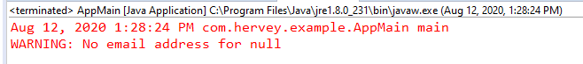

Created this simple project as follow-along to Christian Neumanns's article:  <ins>A quick and thorough guide to ‘null’: what it is, and how you should use it</ins>

He uses code to illustrate his points--some replicated in the project with comments here.

 
## Person object where email may or may not be null
   * Below results from person.getEmailAddress when emailAddress is null

   *   

## List<Allergy> example
  * The code shows his not recommended case.  If the patient's shows no allergy with an empty List or null--either case and this project shows either/both--then the user/client cannot know what it means.  As Christian stated:
  "Does it mean that the patient doesn't have allergies, or does it mean that an allergy test has not yet been performed? These are two semantically very different cases that must be handled differently. Or else the outcome might be life-threatening."

# Solution:

  * Allergy test results will have three different actual types based on the stage of testing:  Done, NotDone, or Pending
     * Only one type illustrated
  * They will all have the same Reference type which is a higher interface: AllergyTestResult
  * The method getAllergiesOfPatientByIdUsingInterface uses "instanceof" to vary the processing and thus the result of the Allergy tests

